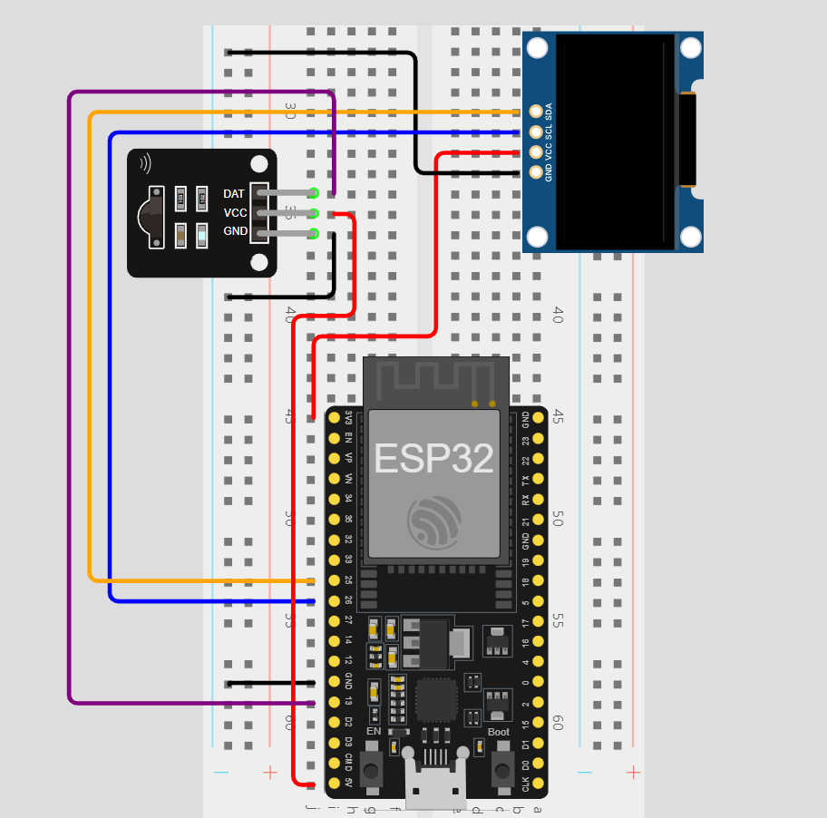

# ESP32 IR Remote Control with REST API Integration  
**Control your devices with an IR remote and ESP32!** Perfect for home automation, media control, and IoT projects.

## ⭐ What this repository is made for

This project enables an ESP32 microcontroller to respond to IR remote signals and invoke corresponding REST API endpoints. When the ESP32 receives an IR command, it sends a request to a Python server that executes a specific action—ranging from controlling VLC for media playback to handling custom home automation tasks.

The repository includes:
- **Basic Script & Server**: A simple example mapping each remote button to a specific API endpoint.
- **Advanced Media Control Script & Server**: An enhanced example that launches media files stored in a directory with VLC, mimicking the functionality of a TV remote.

## 🚀 Features
- **IR Remote Control**: Use any IR remote to trigger actions.
- **REST API Integration**: Send HTTP requests to control devices or services.
- **Customizable**: Easily adapt the code for your specific needs.

## 💡 Use Cases
- **Home Automation**: Control lights, fans, or appliances with an IR remote.
- **Media Control**: Play, pause, or skip tracks on your media server.
- **Custom IoT Projects**: Trigger REST APIs for custom applications (e.g., sending notifications, controlling robots).
- **Accessibility**: Create a remote control for individuals with limited mobility.

## 🔧 How to use this repository

### Hardware Setup Diagram

### Setup ESP32
- Check the ESP32 script you want to work with.
- Be sure to have an ESP32 ready and connected to an IR receiver (and to a SSD1306 screen, if you want to use the script to control VLC).
- Enter your WiFi's SSID and password in the script.
- Replace the values of the buttons in the script with those corresponding to your IR device's buttons (You can find your device's buttons values with the IRremote library SimpleReceiver example).
- Make the adjustments you may want in the script to achieve the desired behaviour.

### 3. Python Server Setup
- Install Python dependencies using `pip install -r requirements.txt`.
- If you wish to use the supplied VLC server, update the `MEDIA_DIR` variable in the Python script to point to your media file directory and ensure that VLC is installed and its executable is added to your system's PATH.
- Run the FastAPI server using `uvicorn`.

## 📚 Libraries used

- **[Arduino core for the ESP32](https://github.com/espressif/arduino-esp32)**: Enables programming the ESP32 using the Arduino IDE.
- **[IRremote](https://github.com/Arduino-IRremote/Arduino-IRremote)**: Decodes IR signals from the remote control.
- **[U8g2](https://github.com/olikraus/u8g2)**: Drives the OLED display to show the current track or status.
- **[ArduinoJson](https://arduinojson.org/)**: Parses JSON responses from the server.